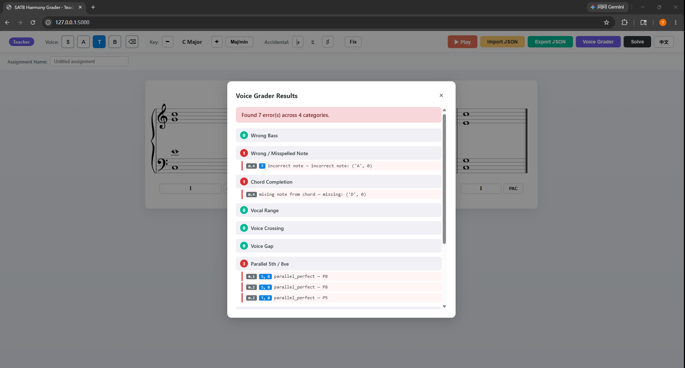
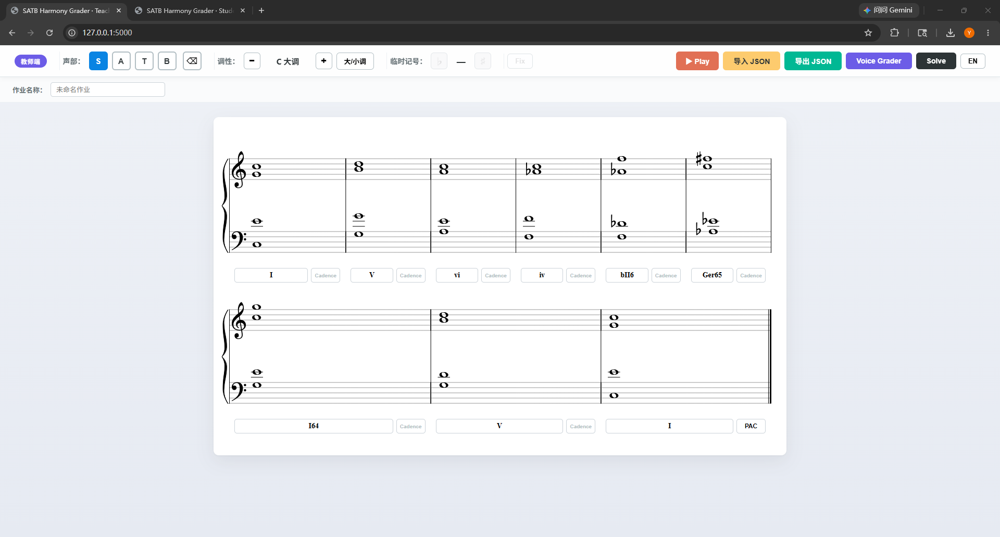

# SATB Harmony Solver & Grader

*A browser-based symbolic music system for SATB harmony generation and pedagogical feedback.*

---

## Overview

This project is a small research/teaching prototype for four-voice (Soprano, Alto, Tenor, Bass) tonal harmony. It combines two pieces of work that I wrote myself:

- A **rule-based grader** that audits a completed SATB realization against the standard part-writing rule set (parallels, voice crossing, range, leap, chord completion, resolution, …) and reports errors by category.
- A **heuristic SATB solver** that fills in missing voices given a Roman-numeral skeleton, with cadence-aware soprano planning, fixed-note attraction fields, and a phrase-apex preference.

The Python implementation of both voice_grader.py and voice_solver.py is the author's own. The grader's rule set adapts the harmony curriculum of Dr. John Paul Ito (see Acknowledgements); the solver's design—two-stage beam search, gravity field, cadence-aware planning—is original to this project.

The engine is exposed through a browser UI that supports a teacher/student workflow:

- The **teacher** authors an assignment (key, Roman numerals, optional fixed notes, cadence tags), exports it as a JSON file, and later imports a student's submission for one-click grading.
- The **student** loads the assignment, completes the missing voices in a VexFlow-rendered score, listens to it on a SoundFont piano, optionally self-checks via the grader, and exports a submission.

The two roles run as **independent Flask processes** on separate ports, sharing only the engine and a small frontend module library.


*The Voice Grader returns errors partitioned into eleven labelled categories, each tagged with the offending voice and measure.*

---

## Core concepts

- **Symbolic music representation** — every note is a `(midi_pitch, letter, accidental)` tuple. The same shape flows through the engine, the JSON file format, and the VexFlow renderer.
- **Rule-based harmony grading** — eleven error categories implemented in [voice_grader.py](voice_grader.py).
- **Heuristic SATB solving** — two-stage beam search (bass first, then SAT) implemented in [voice_solver.py](voice_solver.py).
- **Fixed-note attraction fields** — instructor-fixed notes and cadence-derived structural sopranos exert a soft "gravity" on the search, so the solver bends nearby voices toward them rather than treating them as isolated hard constraints.
- **Cadence-aware phrase shaping** — the solver plants scale-degree anchors at user-tagged cadence points before search begins.
- **Teacher / student workflow** — a single JSON schema serves both `assignment` and `submission` documents; the student app interprets every non-empty field as a lock, so students can only fill empty slots.

---

## Key design decisions

### Notes carry spelling, not just MIDI pitch

Every note is a `(midi_pitch, letter, accidental)` tuple. MIDI alone collapses 
enharmonic distinctions (D♯ vs. E♭) that matter in tonal harmony — leading tones 
and chord sevenths must be spelled correctly to resolve correctly. Carrying the 
spelling explicitly lets the grader catch errors invisible to a MIDI-only system.

### Eleven error categories, not a single pass/fail

The grader returns errors partitioned into eleven labelled categories, each tagged 
with the offending voice and measure. This mirrors how teachers actually mark 
four-part writing — as a diagnostic profile rather than a binary verdict. The 
taxonomy follows the curriculum of Dr. John Paul Ito (see Acknowledgements).

### Two-stage search: bass first, then SAT

Searching jointly over all four voices explodes combinatorially. Committing to a 
bass line first reduces the problem to filling three voices over a known bass — a 
much smaller space, and one where the harmonic identity is already pinned down. 
Well-formed bass lines almost always admit at least one acceptable completion; 
ill-formed ones admit none regardless of upper-voice effort.

### Fixed notes as an attraction field, not as hard constraints

Instructor-fixed notes are the pedagogically important pitches. Treating them as 
hard constraints makes the search route around them and leaves the surrounding 
measures awkward. Instead, they exert a soft gravity on nearby measures, pulling 
the line toward the fixed pitch — slightly stronger for *future* targets than 
past ones, so the line *prepares* toward each anchor rather than merely 
remembering where it came from.

---

## Features

- **Teacher Mode** — full editing (voices, key, accidentals, fixed-note hints), measure insert/delete, automatic Solver, Voice Grader, JSON export with grader-permission toggle, JSON import (assignments or submissions).
- **Student Mode** — restricted editing on top of an imported assignment; locked content is read-only and visually distinguished. Optional Voice Grader self-check (gated by the teacher's permission flag in the JSON).
- **JSON assignment workflow** — round-trippable `assignment_*.json` and `submission_*.json` files; see [docs/json_schema.md](docs/json_schema.md).
- **Automatic grading** — eleven error categories, displayed in a categorised modal with per-error voice and measure tags.
- **Solver-generated reference solution** — teacher-only Solve button to obtain a complete realisation of the current Roman-numeral skeleton.
- **VexFlow score rendering** — multi-system layout, per-voice colouring, click-to-place, keyboard pitch nudging.
- **Piano playback** — SoundFont-based playback of the current score for ear-training.

---

## Project structure

```
.
├── app.py                  Flask application factory: create_app(role)
├── run_teacher.py          Teacher launcher (port 5000)
├── run_student.py          Student launcher (port 5001)
│
├── voice_grader.py         Rule-based grading engine
├── voice_solver.py         Heuristic SATB solving engine
│
├── templates/
│   ├── teacher.html        Teacher UI shell
│   └── student.html        Student UI shell (no Solve / Fix / Key controls)
│
├── static/
│   ├── shared/             Mode-agnostic frontend modules
│   │   ├── base.css
│   │   ├── music.js        Pitch math (key signatures, midi conversion)
│   │   ├── io.js           JSON download / upload helpers
│   │   ├── playback.js     SoundFont piano playback
│   │   ├── score.js        VexFlow rendering, click & keyboard input, RN/cadence inputs
│   │   └── grader.js       /api/grade caller and result modal
│   ├── teacher/            Teacher entrypoint (full feature set)
│   ├── student/            Student entrypoint (lock semantics)
│   └── vendor/             VexFlow + SoundFont (third-party)
│
├── docs/
│   ├── architecture.md     Layered split, runtime topology, callback contract
│   ├── json_schema.md      Assignment / submission file format
│   ├── solver_design.md    Two-stage search, gravity field, cadence heuristics
│   └── roman_numeral_reference.md       Supported Roman Numerals Input
│
├── examples/
│   ├── assignments/        Sample assignment JSON
│   ├── submissions/        Sample submission JSON
│   └── screenshots/        UI screenshots
│
└── requirements.txt
```

The engine has no dependency on Flask. The two launchers are thin: each calls `create_app(role)` and runs Flask on its own port. The student app never imports `voice_solver.py`.

See [docs/architecture.md](docs/architecture.md) for details.

---

## How to run

```bash
pip install -r requirements.txt

# Teacher server (full feature set, port 5000)
python run_teacher.py

# Student server (Grader only, port 5001) — run in a second terminal if needed
python run_student.py
```

Open `http://127.0.0.1:5000/` for the teacher UI or `http://127.0.0.1:5001/` for the student UI. The two servers are independent processes and may run together or separately.

---

## Environment

- Python 3.13 (tested)
- Flask 3.x is the only non-standard library dependency on the backend.
- Frontend dependencies (VexFlow, soundfont-player) are vendored in `static/vendor/`.

---

## Example workflow

1. **Teacher** opens `:5000`, sets the key and Roman-numeral skeleton, optionally fixes a few notes (e.g. the cadential bass), names the assignment, and clicks *Export JSON*. The export dialog asks whether students may use the Voice Grader for self-check.
2. **Student** opens `:5001`, imports the assignment file, types their name, completes the missing voices (clicking the staff places notes; the eraser button removes them; arrow keys nudge pitch). Locked content (teacher-supplied notes, Roman numerals, cadences) stays read-only. Optionally clicks *Voice Grader* for category-by-category feedback. Clicks *Export JSON* to save a submission.
3. **Teacher** imports the student's submission. The student's name appears in the meta bar. *Voice Grader* now produces the official feedback for that submission; *Solve* can also be used to regenerate a reference solution.

Sample files are provided in [examples/](examples/).


*The Solver fills out SATB over a Roman-numeral skeleton containing chromatic progression.*


---

## Future work

- **Contour-aware melodic planning.** The current solver shapes the soprano via cadence anchors and an apex preference, but does not model phrase-level melodic contour explicitly.
- **Corpus-based vs. rule-based preferences.** The current cost function encodes preferences as hand-tuned weights. An open question this prototype raises is which preferences are actually grounded in repertoire and which are pedagogical conventions. Comparing hand-tuned costs against weights learned from the JSB Chorales corpus would help separate prescriptive rules from emergent stylistic regularities.
- **Adaptive pedagogical feedback.** The grader currently lists rule violations uniformly. A natural next step is grouping related errors and surfacing the underlying conceptual cause (e.g. *"this consecutive 5th comes from doubled-third voicing in the previous chord"*).

---

## Acknowledgements
- The voice-leading rule set implemented in `voice_grader.py` is adapted, with permission, from the harmony curriculum developed by **Dr. John Paul Ito** (Carnegie Mellon University), published at [his Harmony I & II course materials](https://www.andrew.cmu.edu/user/johnito/music_theory/harmony1and2/HarmMain.html). 
The error taxonomy and the specification of individual part-writing checks follow his pedagogy; the software architecture, implementation, solver design, and teacher/student workflow were developed for this project.
- [VexFlow](https://www.vexflow.com/) for in-browser music notation rendering.
- [soundfont-player](https://github.com/danigb/soundfont-player) and the MusyngKite SoundFonts for piano playback.