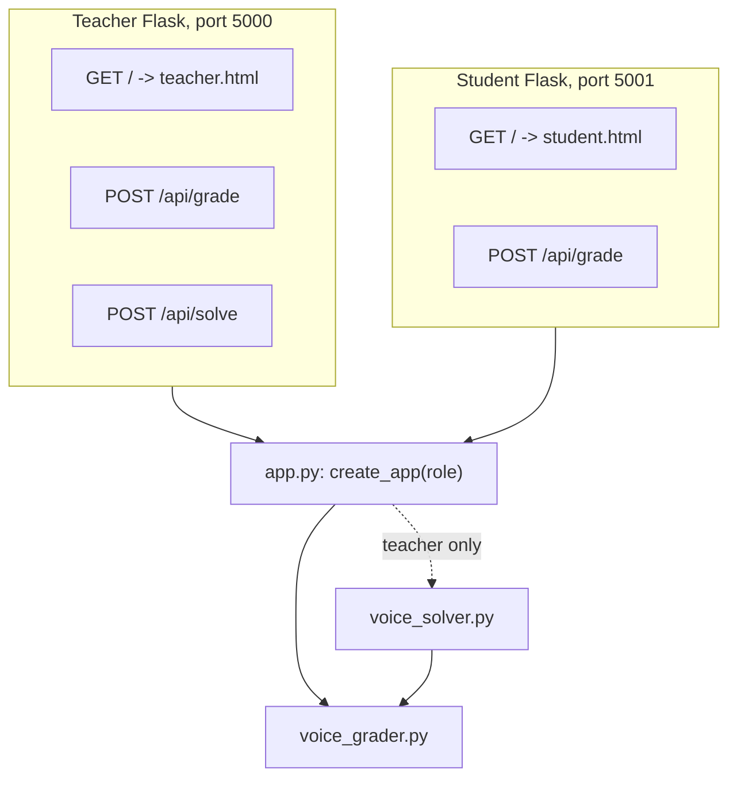
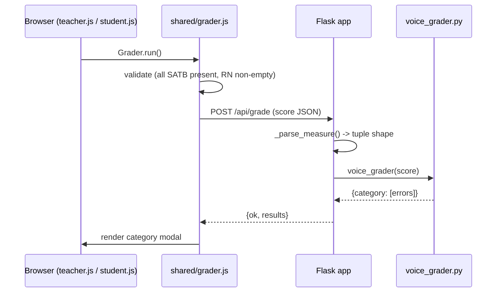
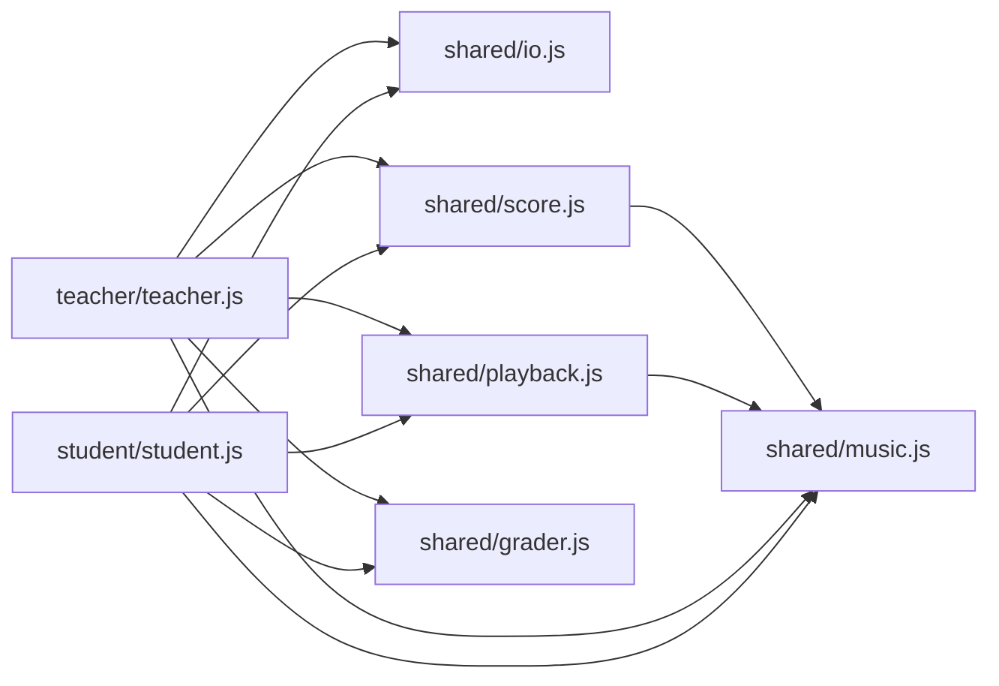

# Architecture

This project is split into four layers, each with a single responsibility:

| Layer | Files | Role |
|---|---|---|
| Engine | [voice_grader.py](../voice_grader.py), [voice_solver.py](../voice_solver.py) | Pure Python; rule-based grading and heuristic solving. No web, no UI, no Flask. |
| Backend | [app.py](../app.py), [run_teacher.py](../run_teacher.py), [run_student.py](../run_student.py) | Flask application factory + two thin role-specific launchers. |
| Shared frontend | [static/shared/](../static/shared) | Mode-agnostic JS/CSS modules: rendering, IO, playback, grader caller. |
| Role frontend | [static/teacher/](../static/teacher), [static/student/](../static/student), [templates/](../templates) | Role-specific HTML, state, i18n, and event wiring. |

The engine is a Python library that knows nothing about HTTP. The teacher and student "applications" are independent Flask processes that happen to share the same codebase.

---

## Runtime topology



- `create_app("teacher")` mounts both `/api/grade` and `/api/solve`. It lazy-loads `voice_solver` on first call.
- `create_app("student")` mounts only `/api/grade`. The solver module is never loaded into the student process.
- The solver itself imports the grader (`import voice_grader as vg`) and uses it as a constraint oracle inside the search.

---

## Request flow

A typical Voice Grader call:



The `/api/solve` flow is structurally identical, except the payload is a `harmony_problem` dict and the response carries a fully realised score.

---

## Frontend module graph



The shared modules are loaded into the global namespace (`window.Music`, `window.IO`, `window.Playback`, `window.Score`, `window.Grader`). There is no bundler; HTML `<script>` tags load them in dependency order.

`shared/score.js` is the largest module. It owns VexFlow rendering, click and keyboard handling, the Roman-numeral and cadence input rows, and the insert/delete overlay buttons. It is mode-agnostic by accepting a callback bag at init:

```js
Score.init({
    state,
    callbacks: {
        canEditNote(m, v),         // permission check (lock semantics)
        afterPlaceNote(m, v),      // bookkeeping (e.g. fixedNotes / studentAdded sets)
        afterEraseNote(m, v),
        isRomanLocked(m),
        isCadenceLocked(m),
        getNoteOpts(m, v),         // -> {fixed: bool} for red colouring
        showMeasureControls(),
        onInsertMeasure(idx),
        onDeleteMeasure(idx),
        onSelectionChange(),       // refresh accidental display, fix button, etc.
    },
    labels: { /* i18n strings + placeholder text */ },
});
```

Teacher callbacks always permit edits and report the current `fixedNotes` set. Student callbacks consult the per-import lock sets (`lockedNotes`, `lockedRN`, `lockedCad`, `lockedCount`) and surface a toast on rejection.

---

## API summary

| Method | Path | Teacher | Student | Purpose |
|---|---|---|---|---|
| GET | `/` | teacher.html | student.html | UI shell |
| POST | `/api/grade` | yes | yes | Run the grader on a posted score |
| POST | `/api/solve` | yes | **404** | Run the solver on a posted harmony problem |

`/api/grade` accepts `{score: [...]}` and returns `{ok: true, results: {category: [errors]}}`.

`/api/solve` accepts `{harmony_problem: {score, cadences, fixed_notes, fixed_chords}}` and returns either `{ok: true, solved: true, score: [...]}` or `{ok: true, solved: false, score: null}`.

See [json_schema.md](json_schema.md) for the on-disk file format used by the import/export buttons.
